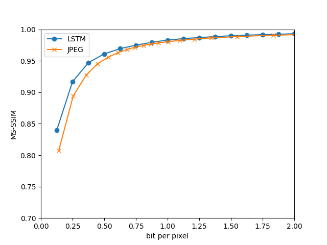

# Recurrent Neural Network for Image Compression

## 1. Introduction

This is the repo of our recurrent neural network for Image Compression optimized for human visual system. In this work, an architecture consist of a RNN-based encoder and decoder, a binarizer, and a neural network for entropy coding was designed. Compared with jpeg standard and some improved jpeg versions, the model can get 4.3%-8.8% AUC depending on the perceptual metric like MS--SSIM. The work shows that the trained model can outform JPEG at image compression across most bitrates on the rate-distortion curve on the Kodak dataset images no matter with or without the aid of entropy coding.

## 2. Prerequosites

1. The test script must run on linux, so linux/wsl is needed;
2. The train and test process depends on CUDA, so Nvdia GPU and CUDA are needed;
3. At least 25GB storage is needed if you want to train by yourself. MSCOCO 2017 was used for training in the work;

## 3. Test

0. Environment setup
    ```bash
    conda create -n rnn_img_compression python=3.9
    conda activate rnn_img_compression
    pip install torch torchvision torchaudio
    pip install scipy
    pip install fiftyone
    sudo apt install imagemagick
    ```

Assumed that your terminal is in the project root repository.
1. Get the pre-trained models from Github and put them in the `./checkpoint` folder;
2. Get the kodak dataset
    ```bash
    bash test/get_kodak.sh
    ```
3. Encode and decode by using the pre-trained model
    ```bash
    bash test/enc_dec.sh
    ```
4. Encode and decode by using jpeg
    ```bash
    bash test/jpeg.sh
    ```
5. Calculate the MS-SSIM
    ```bash
    bash test/calc_ssim.sh
    ```
6. Draw the rate-distortion curve
    ```bash
    python test/draw_rd.py
    ```
## 4. Train

0. Prepare the MS-COCO 2017 dataset
    ```bash
    python coco.py
    ```
1. Train the model
    ```bash
    python train.py -f <yourfilepathtococo>
    ```
The in-process training will be saved in the `./checkpoint` folder.

## 5. Results

We show the LSTM's performance is better than JPEG's.



## 6. Conclusion

It is shown that the RNN-based model can outperform JPEG at image compression across most bitrates on the rate-distortion curve on the Kodak dataset images no matter with or without the aid of entropy coding. The model can get 4.3%-8.8% AUC depending on the perceptual metric like MS--SSIM. It shows the potential of using neural network to do image compression task.

## 7. Future Work

1. Update the LSTM to GRU;
2. Try to use Vision Transformer to replace the RNN;
3. Try to use grand new neural networks;
4. Try to add entropy coding binary-cnn to get the better performance;
5. Try to use GDN to replace the ReLU in the model;

## 8. Acknowledgement


## 9. References

1. The code is based on the paper "End-to-End Optimized Image Compression" by Johannes Ballé, Valero Laparra, Eero P. Simoncelli;
2. The code is based on the paper "Variational Image Compression with a Scale Hyperprior" by Johannes Ballé, David Minnen, Saurabh Singh, Sung Jin Hwang, Nick Johnston;
3. The code is based on the paper "Neural Image Compression" by George Toderici, Damien Vincent, Nick Johnston, Sung Jin Hwang, David Minnen, Joel Shor, Michele Covell;
